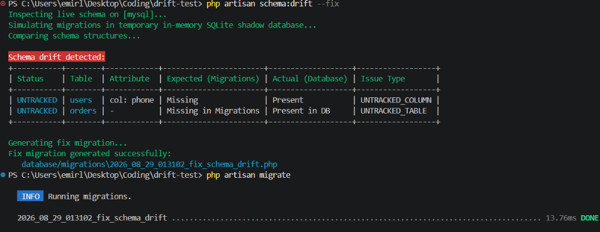

# Laravel Schema Drift Detector


## Why `laravel-schema-drift`?

In a perfect, strictly-regulated CI/CD environment with immutable infrastructure, schema drift shouldn't happen. If your database is completely locked down and every single change goes through a Laravel migration, you might not need this package. 

However, in the real world, development is messy. This package serves as an early-warning system and safety net for the following common scenarios:

* **The 3 AM Emergency Fix:** A DBA or senior engineer manually adds a critical missing index or tweaks a column type directly in production to stop a crash, but forgets to write the backport migration the next morning.
* **Shared & Legacy Databases:** Your Laravel application doesn't exclusively own the database. You are sharing it with a legacy app, a data engineering team, or third-party tools that don't use Laravel migrations.
* **Staging & QA Environments:** Developers and QA teams often have more permissive access in staging environments to test theories. Drift detection ensures these environments haven't diverged significantly from your migration files before a production deployment.
* **Auditing & Peace of Mind:** A "belt-and-suspenders" approach to infrastructure. It allows you to programmatically verify that your code's understanding of the database perfectly matches reality.

If you are dealing with legacy systems, fast-moving startup environments, or just want absolute certainty that your production database matches your codebase, `laravel-schema-drift` catches the discrepancies before they cause a bug.

A powerful, zero-config Artisan command to detect schema drift between your live database and your Laravel migration files. 

Ever wonder if someone manually tweaked a database column directly in production without writing a migration? Or if a legacy table is sitting in your database completely untracked? This package catches those discrepancies instantly, integrates seamlessly into your CI/CD pipelines, and can even generate the fix migrations for you automatically.

<p align="center">
  
</p>

## How It Works

Behind the scenes, the package uses a clever "shadow database" approach:
1. It takes a snapshot of your live database schema.
2. It spins up a temporary in-memory SQLite database (or connects to your configured shadow database) and runs all your migration files.
3. It compares the two schemas and outputs a terminal table highlighting missing tables, untracked columns, nullability mismatches, type drift, default value drift, and index discrepancies.
4. **Instant Fix**: Generate a Laravel migration with a single flag (`--fix`) to bring your migrations in sync.
5. **CI/CD Ready**: Output machine-readable JSON, Markdown, or native GitHub Actions workflow annotations to fail PRs with clickable inline diffs.

## Features

- **Zero-Config Drift Detection**: Compare live databases directly against migration files.
- **Automatic Migration Generator (`--fix`)**: Automatically generate a timestamped Laravel migration to synchronize detected drift without writing boilerplate code manually.
- **CI/CD & Pipeline Formats**: Output structured `json`, Markdown tables (`markdown`), or GitHub Actions workflow annotations (`github`).
- **Severity & Failure Controls**: Categorizes drift by severity (`error` vs `warning`) with configurable thresholds (`--min-severity=error|warning`).
- **Cross-Database Type Normalization Engine**: SQLite shadow databases use loose type affinity. Our built-in `TypeNormalizer` accurately maps dialect-specific column types across **MySQL**, **PostgreSQL**, **SQLite**, and **SQL Server** to canonical types (`integer`, `bigint`, `boolean`, `decimal`, `string`, `datetime`, `json`, `binary`), eliminating false-positive type mismatches (e.g. MySQL `TINYINT(1)` vs SQLite boolean/integer).
- **Smart Default Value Normalization**: Strips dialect-specific default wrappers (such as Postgres casts `'val'::character varying`, SQL Server `((0))`, MySQL bit literals `b'1'`, and boolean string variants) to ensure accurate default comparisons.
- **Custom Shadow Connections**: Have migrations containing raw SQL statements, full-text indexes, GIS/spatial types, or stored procedures that fail on SQLite? Pass a real shadow connection (e.g. `--shadow-connection=mysql_testing`) to run migrations against a dedicated test database.
- **Built-in Safety Guardrails**: Prevents accidentally running shadow migrations against your target live/production connection.
- **Fine-Grained Strictness Checks**: Enable or disable checks for indexes, foreign keys, column types, and defaults.
- **Ignore Patterns**: Exclude vendor, framework, or legacy tables with wildcard support (e.g. `pma__*`).

## Requirements

- PHP 8.2 or higher
- Laravel 11.0, 12.0, or 13.0
- SQLite PHP extension enabled (when using the default in-memory shadow database)

## Installation

You can install the package via Composer as a `dev` dependency:

```bash
composer require emirkefi/laravel-schema-drift --dev
```

Publish the configuration file (optional):

```bash
php artisan vendor:publish --tag=schema-drift-config
```

## Usage

### Basic Drift Check
Run the drift check against your default database connection:

```bash
php artisan schema:drift
```

### Auto-Fix with Migration Generation 
Automatically generate a Laravel migration to fix detected drift:

```bash
php artisan schema:drift --fix
```

To include destructive drop operations (e.g. dropping columns or tables in migration that do not exist in the live database):

```bash
php artisan schema:drift --fix --destructive
```

### CI/CD & Pipeline Formats
Output machine-readable JSON:

```bash
php artisan schema:drift --format=json
```

Output GitHub Actions workflow annotations with inline errors/warnings:

```bash
php artisan schema:drift --format=github
```

Output Markdown summary table:

```bash
php artisan schema:drift --format=markdown >> $GITHUB_STEP_SUMMARY
```

Fail CI only on critical errors (e.g. missing tables/columns, type mismatches):

```bash
php artisan schema:drift --min-severity=error
```

### GitHub Actions Workflow Example
Add this job step to your CI pipeline:

```yaml
- name: Check Schema Drift
  run: php artisan schema:drift --format=github --min-severity=warning
```

### Standalone Migration Generator Command
You can also invoke the migration generator directly:

```bash
php artisan schema:drift:generate-migration --name=sync_legacy_schema
```

### Custom Live Connection or Migration Path
Check a specific database connection or custom migration directory:

```bash
php artisan schema:drift --connection=mysql --path=database/migrations
```

### Custom Shadow Connection (MySQL / PostgreSQL / SQL Server)
When migrations contain engine-specific SQL or spatial indexes that SQLite doesn't support, supply a dedicated test database connection:

```bash
php artisan schema:drift --connection=mysql --shadow-connection=mysql_testing --fresh-shadow
```

## Configuration

In `config/schema-drift.php`, you can customize formats, severity thresholds, shadow connections, strictness checks, and ignored tables:

```php
return [
    /*
    | Shadow Database Connection
    | Set to null for default in-memory SQLite, or specify a test connection name
    */
    'shadow_connection' => env('SCHEMA_DRIFT_SHADOW_CONNECTION', null),
    'fresh_shadow' => env('SCHEMA_DRIFT_FRESH_SHADOW', true),

    /*
    | CI/CD & Output Settings
    */
    'default_format' => env('SCHEMA_DRIFT_FORMAT', 'table'),
    'min_severity' => env('SCHEMA_DRIFT_MIN_SEVERITY', 'warning'),

    /*
    | Ignore system or vendor tables from drift analysis
    */
    'ignore_tables' => [
        'migrations',
        'failed_jobs',
        'job_batches',
        'sessions',
        'cache',
        'cache_locks',
        'password_reset_tokens',
        'pma__*',
    ],

    /*
    | Strictness checks
    */
    'check_indexes' => true,
    'check_foreign_keys' => true,
    'check_types' => true,
    'check_defaults' => true,
];
```

## License

The MIT License (MIT). Please see [License File](LICENSE) for more information.
